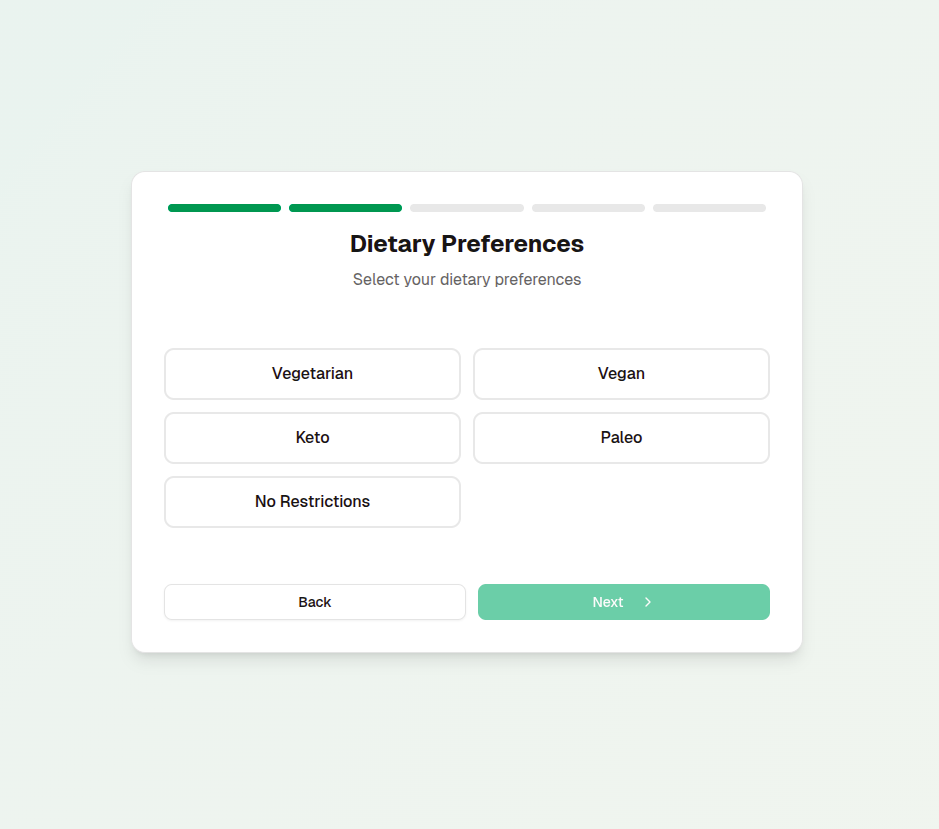
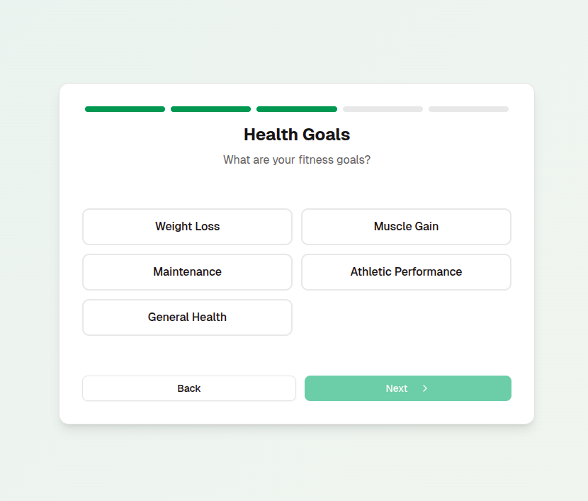

# Testing — Tutorials

## Tutorial (E2E — with images)

**Goal**  
Complete onboarding and finish the dietitian survey.

**Preconditions**
- Built Flutter app (debug build).
- `FEATURE_ONBOARDING_SURVEY=ON` in environment/config.

**Steps**
1. Open the app → ID input screen.  
     
   Enter `test_account_001` and tap **Continue**.
2. Basic — fill Height / Weight / Age.  
    → **Next**
3. Preferences — select dietary options.  
    → **Next**
4. Goals — select a health/fitness goal.  
    → **Next**
5. Activity — choose activity level.  
    → **Next**
6. Start Date — pick a date in the date picker.  
    → **Complete**
7. Verify navigation to the main screen and presence of the 5 tabs:
   - Dashboard   
   - Food Diary   
   - Meals   
   - Calendar   
   - Profile 

> Tip: Use `flutter run -d <device>` for manual verification. Record errors and UI diffs for regression tests.

---

## Commands
- Unit tests:
  ```bash
  flutter test
  ```
- Integration (example):
  ```bash
  flutter test integration_test
  ```
- Lints / static analysis:
  ```bash
  flutter analyze
  ```

---

## Coverage matrix
- Unit
  - Input validation (insurance_id)
  - `SurveyResponse` serialization / deserialization
- Integration
  - Navigation between survey steps
  - Progress persistence / resume behavior
- E2E
  - Full onboarding critical path described above
- Accessibility (A11y)
  - Control labels, focus order, contrast, touch target sizes

---

## Rollout / Flags
- Perform staged rollout before production: 5% → 25% → 50% → 100% with rollback gates (errors, latency, SLO checks) [1].

---

## Notes
- Do not commit screenshots or test data that contain real PHI/PII. Use anonymized placeholders or redact sensitive data.
- Run Phase‑0 (30m) assessment before work to confirm integration points and test data requirements (see delivery workflow) [1].
- Add an automated E2E job in CI that runs the critical onboarding path on a stable emulator image; gate merges on E2E success for this critical path.
